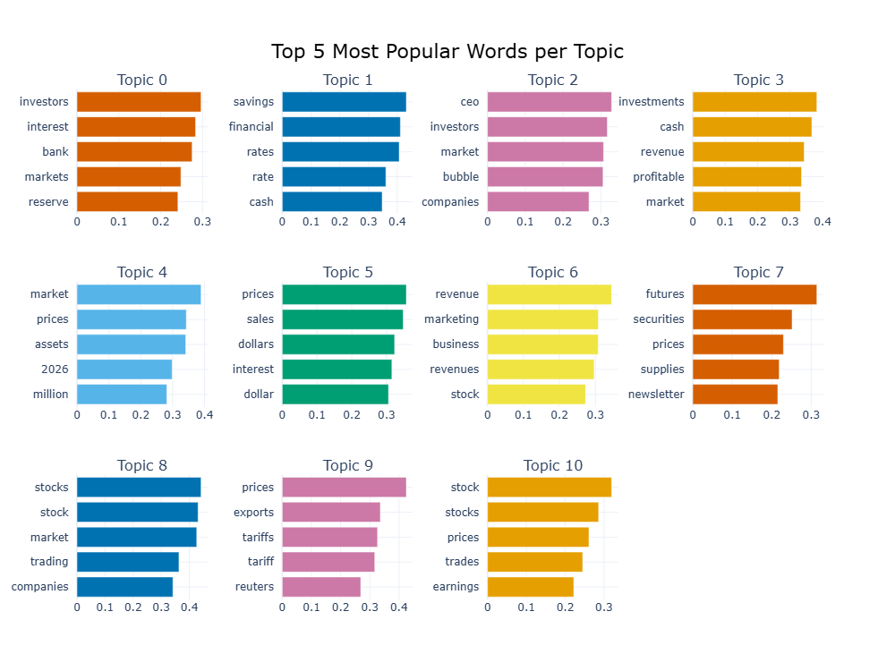
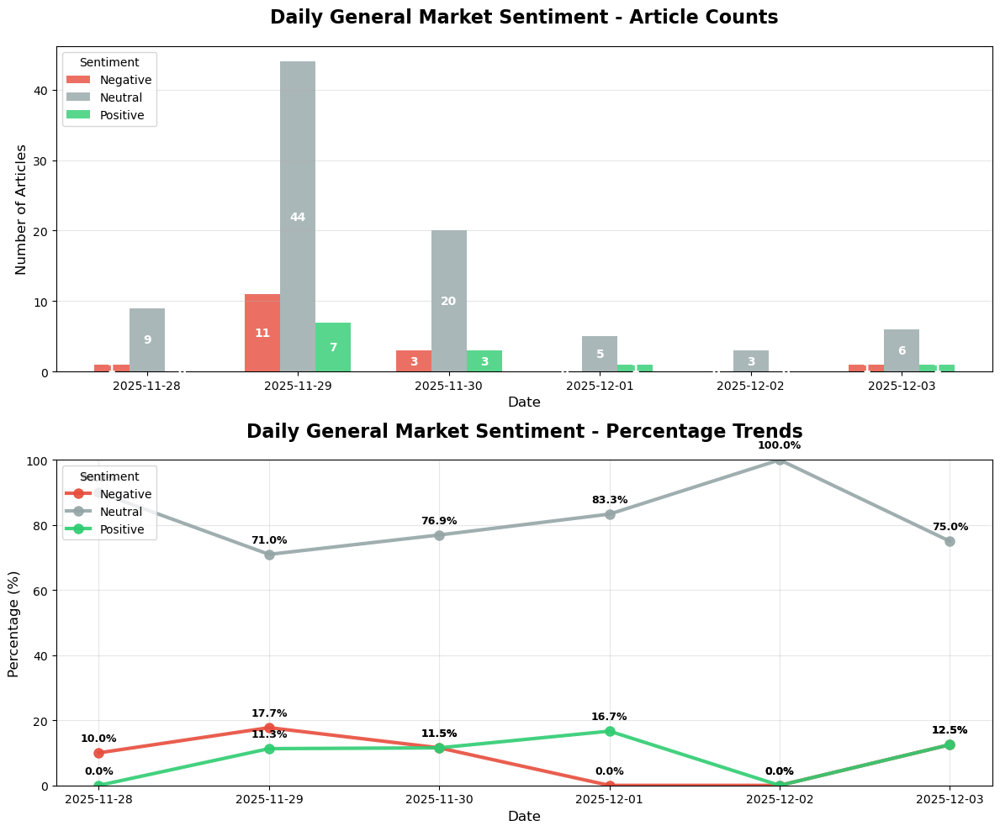

# Yahoo Finance News Analysis Project

## Overview

This project is a comprehensive pipeline for scraping, analyzing, and visualizing financial news from Yahoo Finance. It involves collecting news articles, storing them in a MongoDB database, performing Exploratory Data Analysis (EDA), extracting topics using BERTopic, and conducting sentiment analysis using FinBERT.

The project is divided into 5 main steps:
1.  **Setup MongoDB**: Database configuration.
2.  **Scrape Data**: Automated scraping of Yahoo Finance news.
3.  **Data Cleaning & EDA**: Data preprocessing and exploratory analysis.
4.  **Topic Modeling**: Discovering latent topics in news articles.
5.  **Sentiment Analysis**: Analyzing the sentiment of financial news.

## Prerequisites

-   Python 3.10+
-   MongoDB (Atlas or Local)
-   Chrome Browser (for Selenium)

## Setup

1.  **Clone the repository:**
    ```bash
    git clone 
    cd YahooFinance
    ```

2.  **Install Dependencies:**
    You can install the required packages using `pip`. There are two requirement files, one for the scraper and one for the full analysis.
    ```bash
    pip install -r requirement.txt
    ```

3.  **Environment Variables:**
    Create a `.env` file in the root directory and add your MongoDB credentials:
    ```env
    db_username=your_username
    db_password=your_password
    db_host=your_cluster_address
    MONGODB_CONNECTION_STRING=your_full_connection_string
    ```

---

## Step 1: Setup MongoDB

This project uses MongoDB to store scraped news articles.
1.  Create a MongoDB cluster (e.g., using MongoDB Atlas).
2.  Create a database named `finance_news_db`.
3.  Create a collection named `numerous_articles`.
4.  Ensure your IP is whitelisted in the MongoDB network access settings.
5.  Update the `.env` file with your connection details.

---

## Step 2: Scrape Data from Yahoo Finance

The scraping logic is implemented in `daily_scraper.py` (and `scraper.ipynb`). It uses **Selenium** to handle dynamic content loading (infinite scroll) and **BeautifulSoup** for parsing HTML.

**What the code does:**
-   Navigates to `https://finance.yahoo.com/topic/latest-news/`.
-   Scrolls down automatically to load more articles.
-   Extracts article details: Title, Publisher, Tickers, Link, Author, Time Published, and Content.
-   Inserts new articles into the MongoDB collection `numerous_articles`, avoiding duplicates.

**How to run:**
```bash
python daily_scraper.py
```
*Note: The script runs in headless mode by default.*

### Automation

A GitHub Actions workflow (`.github/workflows/daily_scrape.yml`) is set up to run the scraper automatically every 4 hours. It checks out the code, installs dependencies, and runs `daily_scraper.py` using secrets configured in the GitHub repository.

---

## Step 3: Data Cleaning and EDA

The `Data_Cleaning_&_EDA.ipynb` notebook handles data preprocessing and exploration.

**What the code does:**
-   **Data Cleaning**: Connects to MongoDB, loads data into a Pandas DataFrame, strips whitespace, and converts `time_published` to datetime objects.
-   **EDA**:
    -   Analyzes missing values.
    -   Visualizes the distribution of **Publishers** and **Authors**.
    -   Analyzes the time distribution of articles.
    -   Examines the length of titles and content.

**Result:**
Insights into the dataset structure, such as the most active publishers (e.g., Barchart, Business Insider) and peak publication times.


*(Please save the combined summary plot from the notebook to `images/eda_summary_plot.png`)*

---

## Step 4: Topic Modeling

The `Topic_Modeling.ipynb` notebook uses **BERTopic** to discover underlying themes in the news articles.

**What the code does:**
-   Loads cleaned data from MongoDB.
-   Preprocesses text (removes newlines).
-   Uses **UMAP** for dimensionality reduction and **HDBSCAN** for clustering.
-   Trains a **BERTopic** model to extract topics.
-   Visualizes the most popular words per topic and the document clusters.

**Result:**
Identification of key topics discussed in the financial news, represented by clusters of related keywords.


*(Please save the topic word scores plot from the notebook to `images/topic_modeling_barchart.png`)*

---

## Step 5: Sentiment Analysis

The `sentimental_analysis.ipynb` notebook performs sentiment analysis using **FinBERT**, a BERT model fine-tuned for financial text.

**What the code does:**
-   Loads the **FinBERT** model (`yiyanghkust/finbert-tone`).
-   Analyzes the sentiment (Positive, Neutral, Negative) of each article's title and content.
-   Performs **Ticker-based Analysis**: Aggregates sentiment for specific stock tickers.
-   Performs **Temporal Analysis**: Visualizes sentiment trends over time.

**Result:**
A detailed breakdown of market sentiment, identifying which stocks are receiving positive or negative coverage and how general market sentiment evolves daily.


*(Please save the daily sentiment trend plot from the notebook to `images/sentiment_analysis_daily.png`)*

---


